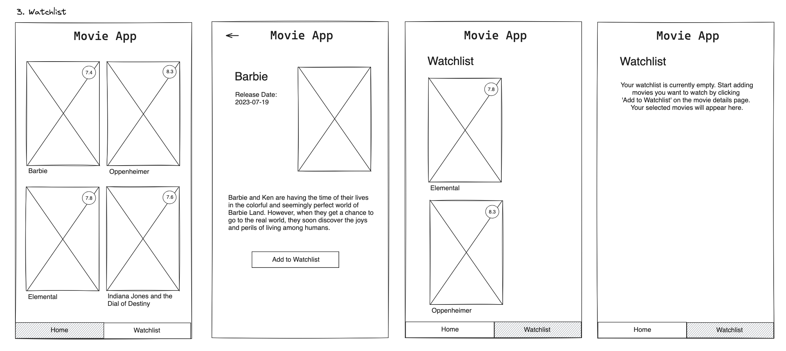

# Title

watchlist for user

## Value Proposition

**As a** film enthusiasts  
**I want to** a filter option  
**so that** can mark a movie to remind user to watch movie  

## Description

## Acceptance Criteria

- thera are a footer navigation bar
- navigation bar with two entries: home and watchlist
- on the details page there is a button to mark the watchlist
- there are a site "watchlist"
- the watchlist site show all movie with marked watchlist

## Tasks

- create a navigation bar in the footer with two entries
- navigation bar is showed on all sites
- create a button on detail page to marked movie for watchlist
- create a new site watchlist
- shwon all movies with marked watchlist on watchlist site with homepage layout
